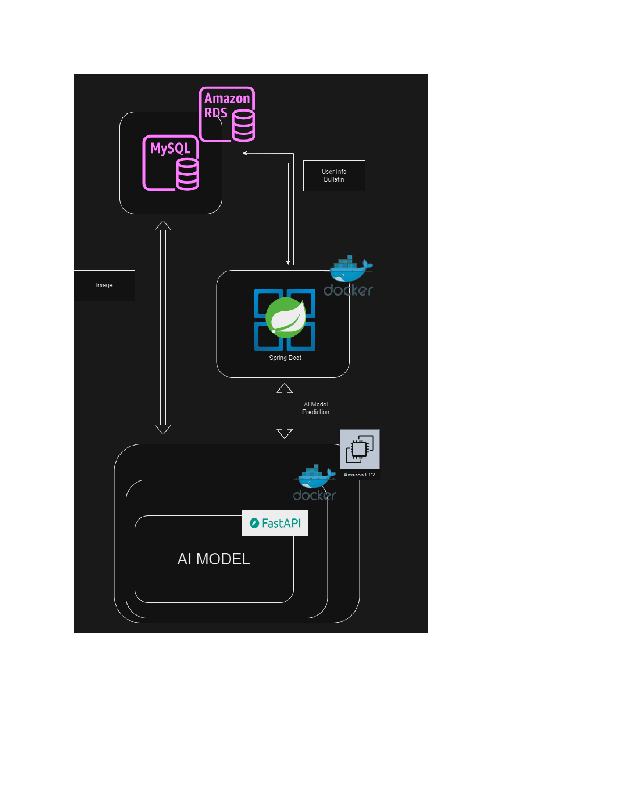

This repository contains basic spring code that implements bulletin, joining membership, login, logout function.

System Architecture

You can deploy my project using Dockerfile.
but you have to write application.properties file to connect with the database.

The below code is structure of application.properties file
<pre><code>
spring.datasource.driver-class-name=com.mysql.cj.jdbc.Driver
spring.datasource.url=jdbc:mysql://host.docker.internal:3306/ai_data
spring.datasource.username=userName
spring.datasource.password=userPassword
spring.jpa.show-sql=true
spring.jpa.hibernate.ddl-auto=update
spring.jpa.properties.hibernate.format_sql=true
spring.jpa.properties.hibernate.dialect=org.hibernate.dialect.MySQLDialect
</code></pre>

The above content is for MySQL.

My code works with [this](https://github.com/dokyung36d/AICOSS_Fastapi)
So if you want to pass all test code, then you have to deploy above project.

You can easily deploy above project using dockerhub.
<pre><code>
docker pull dokyung36d/aicoss:fastapi
</code></pre>

The detail of AI-model is available in [this link](https://github.com/dokyung36d/2023-AICOSS)